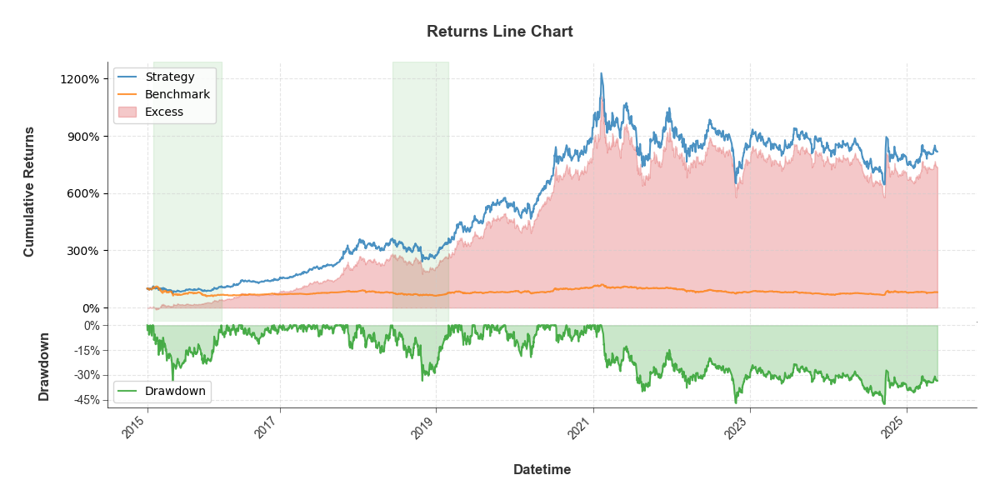
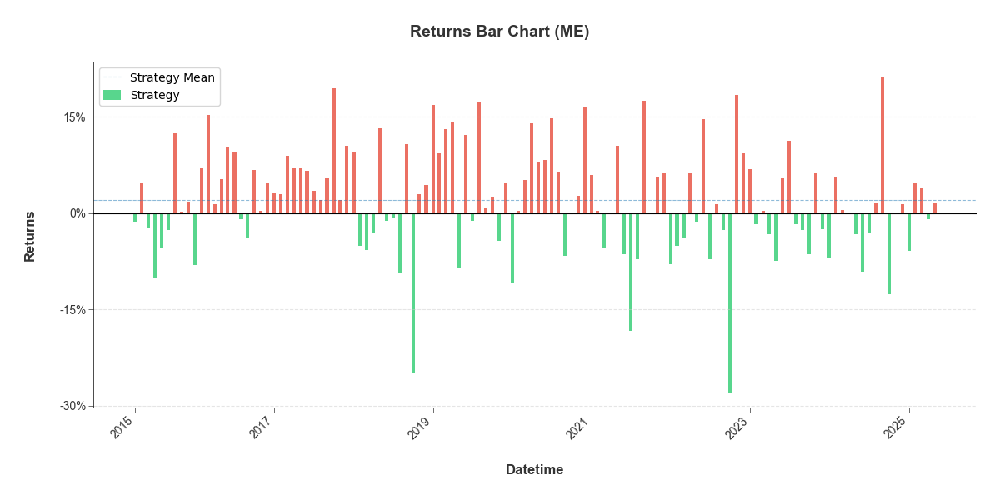
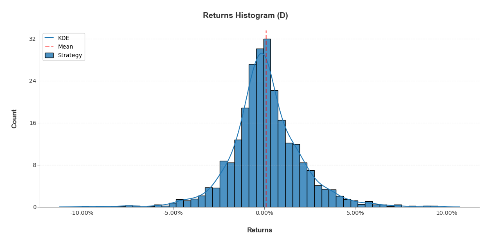
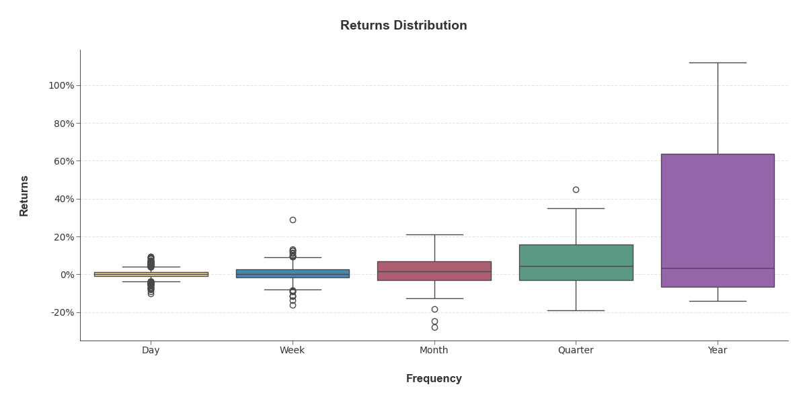
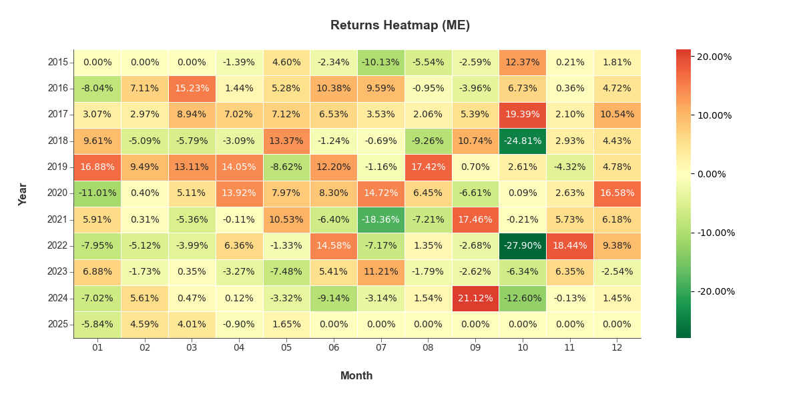
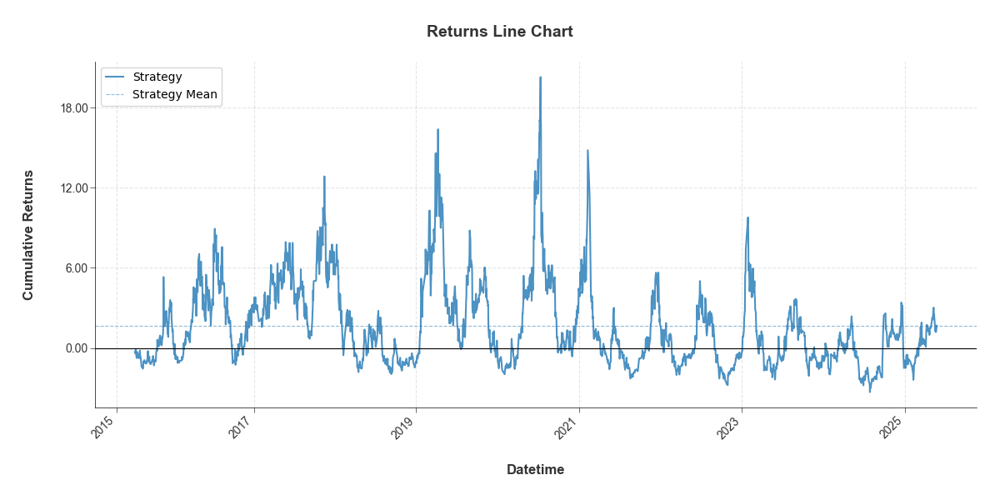

# BTUtils

[](https://www.python.org/)
[](https://opensource.org/licenses/MIT)

## Overview

BTUtils (Backtest Utilities) is a lightweight Python library for backtesting analysis and visualization of trading strategies. Inspired by the excellent [QuantStats](https://github.com/ranaroussi/quantstats) package, BTUtils provides a simplified and streamlined approach to analyze and visualize trading performance.

## Features

- Calculate key performance metrics:
  - Returns (cumulative, annual)
  - Risk metrics (volatility, drawdowns, VaR/CVaR)
  - Ratios (Sharpe, Sortino)
  - Alpha/Beta analysis
  - Win rate and payoff statistics

- Visualize strategy performance:
  - Cumulative returns with drawdowns
  - Return distribution analysis
  - Monthly/yearly heatmaps
  - Rolling metrics (volatility, Sharpe, Sortino, etc.)
  - Comparative analysis against benchmarks

## Installation

```bash
pip install btutils
```
For development installation from source:

```bash
git clone https://github.com/yourusername/btutils.git
cd btutils
pip install -e .
```

## Metrics Report

```python
import pandas as pd
from btutils import Backtest

# Create a Backtest instance from a pandas Series of returns
returns = pd.Series(...)  # Your daily returns data
bt = Backtest(returns, name="My Strategy")

# Display key metrics
print(bt.metrics())
```

Example Output:
```
Start Date             2015-04-27
End Date               2025-05-26
Time in Market %           99.55%
Annual Return %            24.13%
Annual Volatility %        30.33%
Sharpe Ratio                 0.75
Max Drawdown %            -47.48%
Win Rate %                 49.69%
Payoff Rate               118.01%
dtype: object
```

## Performance Metrics

```python
# Calculate individual metrics
sharpe = bt.stats.sharpe_ratio()
max_dd = bt.stats.max_drawdown()
sortino = bt.stats.sortino_ratio()
beta = bt.stats.beta(benchmark)
alpha = bt.stats.alpha(benchmark)

# Get best and worst periods
best_days = bt.stats.best(freq="D", num=5)
worst_months = bt.stats.worst(freq="ME", num=3)

# Print all available metrics
print([method for method in dir(bt.stats) if not method.startswith("_")])
```

## Series Transform
```python
# Transform the return series
drawdowns = bt.to_drawdown()
cumulative = bt.to_cumulative_return()

# Slice by date
ytd = bt.slice_date('ytd')  # Year to date
specific_period = bt.slice_date('20200101', '20241231')

# Rolling metrics
rolling_vol = bt.to_rolling_volatility(window=60)
rolling_sharpe = bt.to_rolling_sharpe(window=60)
```

# Visualize performance

### Cumulative Returns with Drawdowns

```python
bt.plots.line(benchmark=benchmark, show_drawdown=True, worst_num=2)
```



### Monthly Returns Bar Chart

```python
bt.plots.bar(freq="ME")
```



### Return Distribution Histogram

```python
bt.plots.hist()
```



### Return Distribution by Timeframe

```python
bt.plots.dist()
```



### Monthly Returns Heatmap

```python
bt.plots.heatmap(freq="ME")
```



### Rolling Sharpe Ratio

```python
bt.plots.rolling_sharpe()
```



## Documentation

The library consists of three main classes:
- `Backtest`: The main class for handling return series
- `Stats`: For calculating performance metrics
- `Plots`: For visualizing performance

If you want to view all methods, please use the following code, the complete document will be released soon.
```python
print([_ for _ in dir(bt.stats) if not _.startswith("_")])
```

## Requirements

- Python 3.7+
- pandas
- numpy
- matplotlib
- seaborn
- scipy

## License

MIT License

## Acknowledgements

BTUtils was inspired by [QuantStats](https://github.com/ranaroussi/quantstats) but with the goal of providing a more streamlined API focused on the most essential backtesting analytics.
